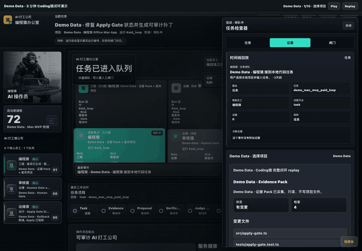

# Codingape Office

**A local-first AI coding worker for Mac.**

Codingape Office helps developers use AI to change code safely.
It reads only the project folder you choose, builds a small task-specific context, generates an AI plan and patch, shows the diff, runs verification, and waits for human approval before writing to your project.

> Your local AI coding worker for macOS: evidence first, diff before write, human approval before apply.



## Why This Exists

AI coding tools are powerful, but many developers still hesitate to let an agent touch a real project.

Codingape Office is built around controlled code changes:

- **No full-disk scan** - the user must choose a project folder.
- **No automatic code writes** - patches stay blocked until approval.
- **Evidence before patch** - see what the worker inspected.
- **Diff before write** - review exactly what would change.
- **Verification before apply** - run project checks before writing.
- **Human Gate + Apply Gate** - approval is required before apply.
- **Rollback available** - snapshots are created before writes.
- **BYO key or local model** - use your own OpenAI, Anthropic, Gemini, Ollama, LM Studio, or OpenAI-compatible endpoint.

## Core Loop

```text
Choose project
  -> Build evidence
  -> AI Plan
  -> Generate patch
  -> Preview diff
  -> Verification
  -> Human Gate
  -> Apply Gate
  -> Rollback Snapshot
  -> Report
```

## What It Is

Codingape Office is:

- a local macOS AI coding worker
- a safety-gated patch workflow
- a local-first AI code modification workbench
- an evaluation harness for AI patch reliability

## What It Is Not

Codingape Office is not:

- a fully autonomous developer
- a tool that silently changes your project
- a cloud service that uploads your whole repo by default
- a replacement for human code review
- a polished App Store release yet

## Features

- **Project Root Guard**: normalizes paths and blocks traversal or writes outside the selected project root.
- **Evidence Pack**: collects git status, changed files, test scripts, and task-relevant context.
- **Model Provider Settings**: supports Demo Only, BYO API key, and local OpenAI-compatible model endpoints.
- **AI Patch Worker**: builds a plan first, then generates a unified diff.
- **Diff Contract Hardening**: extracts safe diff blocks, normalizes simple headers, and retries one formatting-only repair when needed.
- **Verification Runner**: runs allowlisted project verification commands before apply.
- **Human Gate**: the user must inspect and approve before any write.
- **Apply Gate**: applies only when diff, verification, rollback, approval, and root-guard checks are all satisfied.
- **Rollback Manager**: creates snapshots before apply and exposes rollback reports.
- **Support Bundle**: exports diagnostics with secrets redacted.
- **Mac App Shell**: local macOS app packaging scripts for beta and Mac App Store candidate builds.

## Quick Start

Requirements:

- macOS
- Node.js 20 or newer
- Git

Clone and install:

```bash
git clone https://github.com/guamee16888/codingape-office.git
cd codingape-office
npm install
```

Run the local office:

```bash
npm run dev
```

Open:

```text
http://127.0.0.1:4142/office
```

Run tests:

```bash
npm test
```

Run the AI patch benchmark:

```bash
npm run evaluate:ai-patch-worker
```

If no model provider is configured, evaluation reports skipped/demo-only behavior instead of pretending that AI succeeded.

## First Pilot Task

For an external pilot run, open `/office`, choose a small local project folder, and click:

```text
Run First Task: Update README
```

The first task is intentionally small. Codingape Office is local-first and works only with the project folder you choose.

You can review the context preview, plan, proposed diff, and verification results before any change is applied. No code is written until you review the diff and approve the Human Gate.

If no model provider is configured, Codingape Office stays in Demo Only mode and clearly indicates that no AI call was made.

## Model Provider Modes

Codingape Office can run in three modes:

| Mode | What happens |
| --- | --- |
| Demo Only | Runs local safety/demo flows without calling a model. |
| BYO API Key | Uses the user's configured OpenAI, Anthropic, Gemini, or OpenAI-compatible provider. |
| Local Model | Uses a local Ollama, LM Studio, or OpenAI-compatible endpoint. |

When a model is used, Codingape Office may send task-relevant code snippets to the selected provider. It does not upload the whole project by default, and it does not write code before user approval.

## Pilot Feedback

External pilot docs live in:

- `docs/pilot/EXTERNAL_PILOT_RUNBOOK.md`
- `docs/pilot/TESTER_INVITE_TEMPLATE.md`
- `docs/pilot/PILOT_SCORECARD.md`
- `docs/pilot/KNOWN_ISSUES.md`

After the first task, testers can export a redacted feedback JSON under `data/pilot-feedback/`. The lightweight latest metrics file is `data/pilot/latest.json`. These files are local runtime data and are intentionally not committed.

## Contributing And Security

- Read `CONTRIBUTING.md` before opening a pull request.
- Use the GitHub issue templates for bugs, docs/copy, feature requests, and external pilot feedback.
- Use `SECURITY.md` and GitHub Security Advisories for private vulnerability reports.
- Do not include API keys, `.env` contents, private keys, certificates, wallet files, private local paths, or full private source code in issues, PRs, screenshots, support bundles, or docs.

## Safety Principles

- Show evidence before a patch.
- Show diff before a write.
- Run verification before apply.
- Require explicit human approval.
- Block sensitive files.
- Block path traversal.
- Keep rollback available.
- Keep API keys out of logs, screenshots, reports, and support bundles.

## Mac App Builds

Build a local development `.app`:

```bash
npm run build:mac-app
```

Build Developer ID beta distribution artifacts:

```bash
npm run build:mac-distribution
```

Prepare and build the Mac App Store candidate pipeline:

```bash
npm run prepare:mas-runtime
npm run build:mac-app-store
```

The Mac App Store build script is intentionally strict. If signing, provisioning, sandbox entitlements, or runtime material are missing, it fails instead of producing a fake candidate.

## Evaluation

The real AI coding reliability benchmark lives in:

- `docs/evaluation/REAL_AI_TASK_MATRIX.md`
- `docs/evaluation/STAGE12_SCORECARD.md`
- `scripts/evaluate-ai-patch-worker.mjs`
- `test-fixtures/ai-patch-worker/`

Latest local evaluation result:

```text
15 tasks
15 passed
0 fixture invalid
0 pre-existing unrelated failures
0 invalid diff failures
```

These numbers should be treated as local evaluation evidence, not a public guarantee.

## Repository Layout

```text
server.js                         Local office server and API routes
public/                           Office UI, 3D worker room, demo replay
src/                              Safety gates, patch worker, context builder
scripts/                          Build, evaluation, beta, and diagnostics scripts
tests/                            Node test suite
test-fixtures/ai-patch-worker/    Small projects for real AI patch evaluation
docs/                             Product, App Store, evaluation, and 3D docs
integrations/ai-worker-control-plane/
                                  Optional ingestion/control-plane module
```

## Cloudflare Preview

For public preview routing, copy the example and add your own tunnel material:

```bash
cp cloudflared-geoaifactory.example.yml cloudflared-geoaifactory.yml
```

The real `cloudflared-geoaifactory.yml` file is intentionally ignored because it can contain machine-local credential paths.

## Status

This is an early open-source macOS AI coding worker. It is useful for local demos, controlled patch experiments, and safety-gated AI coding evaluation. It is not yet a polished App Store release.

Known limitations:

- It is not a fully autonomous developer.
- Complex tasks can fail or produce invalid diffs.
- Real patch quality depends on the selected model.
- Apple signing, TestFlight, and Mac App Store account steps are handled outside this repository.

## License

MIT
